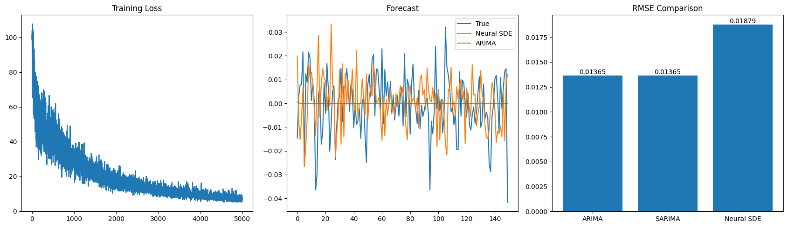
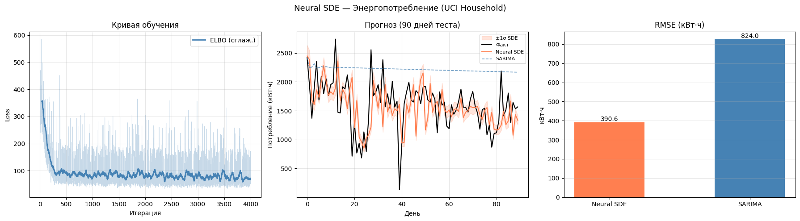

## Что сделано в КТ3

- **Новые датасет** — UCI Individual Household Electric Power Consumption и Yahoo Finance (AAPL),
  почасовые данные 2006–2010, агрегированные в дневные суммы (1433 дня)
- **Baseline модели** — добавлены ARIMA и SARIMA для честного сравнения с Neural SDE
- **KL annealing** — обучение коэффициента $\beta$ перед KL-членом:
  $\beta$ линейно растёт от 0 до 0.05 в течение первых 1500 итераций,
  что стабилизирует начало обучения
- **Исправленный ELBO**

## Результаты

| Модель     | Датасет     | RMSE   |
| ---------- | ----------- | ------ |
| Neural SDE | AAPL (YF)   | 0.019  |
| ARIMA      | AAPL (YF)   | 0.014  |
| SARIMA     | AAPL (YF)   | 0.014  |
| Neural SDE | Electricity | 390.60 |
| SARIMA     | Electricity | 824.01 |




## Зависимости

```bash
pip install torch numpy pandas matplotlib scikit-learn statsmodels tqdm ucimlrepo yfinance
```

## Материалы

- [Tzen & Raginsky (2019) — Latent SDEs](https://arxiv.org/abs/1905.09883)
- [Проект на GitHub Pages](https://moriavohus.github.io/neural-sde-project/)
